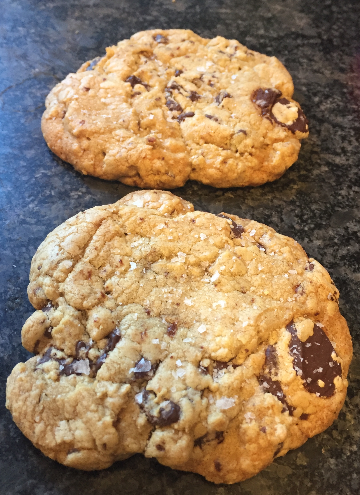
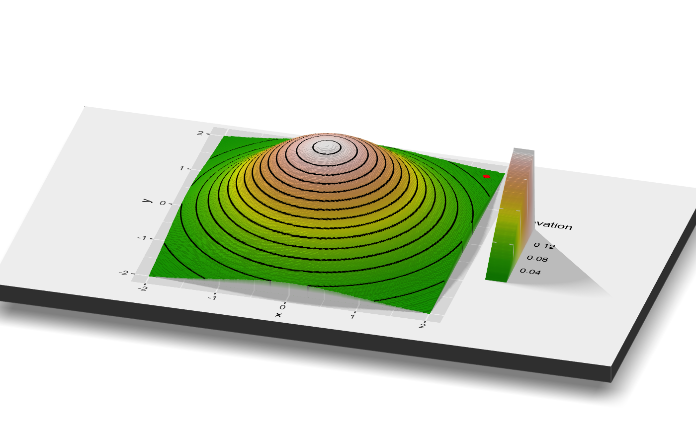
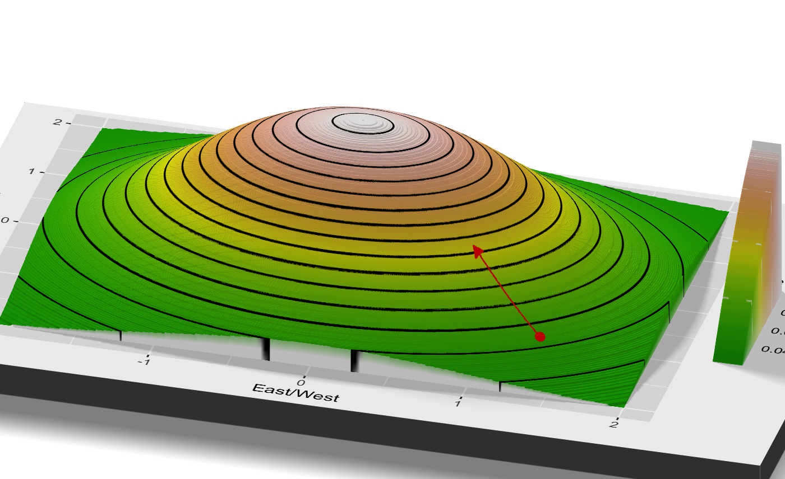
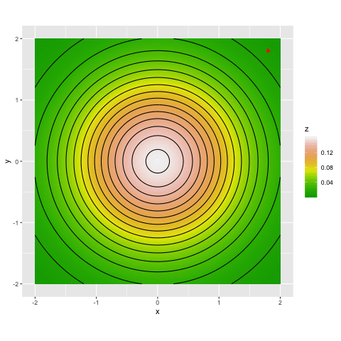
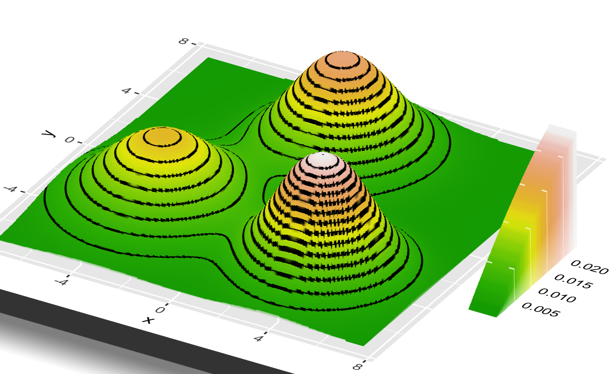
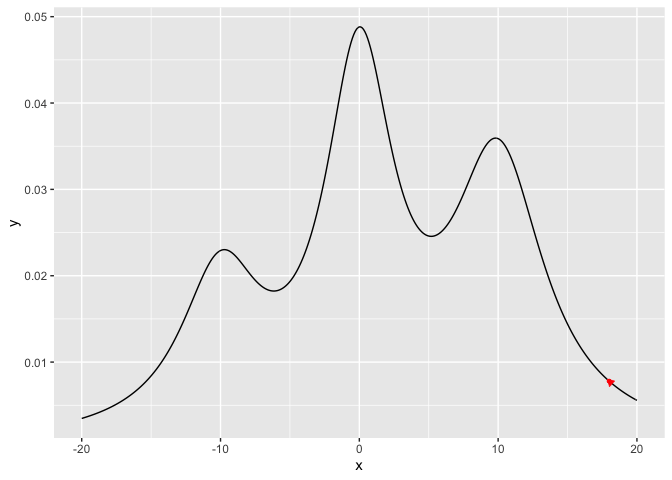

```{r, include = FALSE, message = FALSE}
library(tidyverse)
library(gganimate)
library(transformr)
library(gifski)
```

# A Clockwork Egg
<!-- (or "our optimized lives") -->

I find great comfort in routine. Years of repetition have refined my morning scrambled eggs into a precise and rehearsed ritual. If I turn on the burner before I walk to the fridge, the butter will be just starting to bubble when I finish beating the eggs, and I can clean the mixing bowl in the brief pause before they're ready to be stirred. I never set out to find the right timing, but if you do the same task a thousand times, you learn from the trial and error of random variation which tiny choices make it go just a little smoother. Anyone with a morning commute can relate to the same familiar, iterative optimization. That is, until some external shock *forces* them to change.^[*[I want this post to be quite glib/silly, but this opening might be a little much, or maybe I just haven't been able to word it right. Or might be best to just launch into the Londno Subway example.]*]

# Disruption, and the London Subway Strike

On [February 4th, 2014](https://www.independent.co.uk/news/uk/home-news/tube-strikes-february-2014-how-they-will-affect-your-journey-and-stress-levels-9099641.html), the workers of the London Tube (the underground subway) went on strike, forcing a number of station closures throughout the city. For three days, some (but not all) commuters were unable to take their usual route to work, and were forced to find alternatives. After the strike, the stations reopened, and life went back to normal.

Three economists saw the opportunity for a natural experiment: only certain commuters were disrupted by the closure, and using the subway's tracking data, their movements could be compared to the unaffected group. And surprisingly, life *didn't* quite go back to normal after the ending of the strike. Instead, some of the disrupted group stuck with their newly discovered routes, and their time spent commuting decreased as a result.

The station closures forced commuters to break from their finely tuned routines, but a surprising number found themselves dragged unwillingly along a route that turned out to be *faster* than the one they had been taking for years. The researchers even claim that the time savings from these discoveries were so significant that the strike caused a net *decrease* in time spent commuting, despite the initial disruptions.^[This seems much harder to rigorously prove, but this is meant simiply as an informal framing device.] Even if only a small fraction found new routes, the benefits from their new routine would acrrue over years to come, while discovering it only required a disruption for a few days. 

This neat case study provides an opportunity to frame the mathematical challenge of optimization in real world terms, and it gives particular insight into the counterintuitive fact that many optimization algorithms involve *random noise*. I'll begin by describing mathematical optimization in intuitive terms, and then I'll examine how the London Tube Strike provides a real world analogy for this theoretical challenge.^[*[Not very happy with this transition...]*]^[A rare, and extremely tenuous connection between areas of my research, and reality.] 


<!-- This story provides a neat way to frame the mathematical challenge of optimization, and in particular, why so many optimization algorithms involve *random noise*, a choice which might initially seem bizarre. I'll begin by describing mathematical optimization in intuitive terms, and then show how the results of the London Tube Strike provides an analogy to very real mathematical properties. -->
<!-- ^[I have no personal insight into the rigor of the experiment itself, it's being used just as a framing device here.] -->

# The Framework of "Optimization"
Math always starts with a definition---so, what is "mathematical optimization"? The [DeepAI website](https://deepai.org/machine-learning-glossary-and-terms/mathematical-optimization) writes the following.

> Mathematical optimization is the process of maximizing or minimizing an objective function by finding the best available values across a set of inputs.

It's easiest to explain these terms by example.

* For London commuters, their "objective function" might be the duration of the commute,^[Or they could add in other factors, like cost or "pleasantness".] and the "available values across a set of inputs" might be the route they take.
* If we want to find the highest peak in a mountain range (an example we'll discuss in detail in the next section), the input would the latitude and longitude of a point on the map, and the objective function would be the elevation at that point.
*  When baking chocolate chip cookies, the possible inputs might be the amount of each ingredient and the order in which they are combined, and the objective function might be the tastiness of the resulting cookie. This isn't quite a joke, and Google once ran a [cookie optimization experiment](https://static.googleusercontent.com/media/research.google.com/en//pubs/archive/46507.pdf) along these lines.^[I've tasted the resulting cookies, not bad for a cafeteria batch.]


Optimization is a central challenge in applied mathematics and statistics, but finding solutions can be hard. The vast increase in computational power has broadened our horizons for what optimization challenges are feasible, but many important problems remain out of our reach.

In the challenge of optimization, we generally assume that we are able to check the value of the objective function at some chosen input (often called "queries" to the objective function, or perhaps, the "oracle"). For example...

* We can take a certain route on the subway and use our stopwatch record the duration of the trip.
* We can bake a batch of cookies following a certain recipe, and taste them.
* We buy ElevationBot 1.0, a rather simple computer which takes in a pair of latitude and longitude coordinates, and spits out the altitude of that point. (This example is most cleanly understood using such a computer, but to guide our intuition we'll often imagine ourselves walking around the slopes with an altimeter in hand.)

Our naive optimization strategy might be to just try a bunch of inputs, and hope that we find a good output. For instance, we define a grid of latitude and longitude coordinates, feed these coordinates into ElevationBot 1.0, and use the highest point we find as our answer. But this naive approach only works when the range of potential inputs is sufficiently narrow. In particular, we need to consider the "dimension" of the input space. The number of points within an exhaustive "grid" of inputs grows exponentially with the dimension of the input. Latitude and longitude represent a mere 2 dimensions, so the number of points in our grid is just the square of the number of points on a side. However, the famous [Jacques Torres cookie recipe](https://cooking.nytimes.com/recipes/1015819-chocolate-chip-cookies) has $12$ ingredients. If we wanted to try all combinations at a mere five different amounts of each ingredient, that would be over two hundred thousand possibilities, which is a bit much for even the hungriest baker. 

In our own lives, we constantly confront similar optimization challenges, but we rarely take this naive approach. Instead, we typically to look around us for small *local* optimizations, whose benefits we can easily identify. 

<!-- * Finding the best route on the subway is something we optimize. While often algorithmic services can do the work for us, in other cases (or the past), we have to figure it out ourselves, and we somehow pick our starting point. -->

<!-- * For an example, let's imagine we want to find the highest point in a mountain range. We can check an individual point, and see how high it is. How do we find the highest point? The analogy would be something like, instead of latitude and longitude in a mountain range, in our morning routine it would be that "series of choices for how we get to work".  -->

<!-- * Now, imagine instead of querying a computer for the height, you yourself were actually in that mountain range. What would you do? Well, you'd look for the peak, but what if you were in a forest? You'd go up. Specifically, you would look at the area around you for *local* guidance. -->

# Locality in Optimization

Imagine biting into a warm cookie, fresh out of the oven. The rich buttery center has just the right chew, while the edges are lightly crisp. You taste the faintest hints of toffee, butterscotch, and vanilla, and the sprinkle of sea salt on top adds an extra kick. It's almost perfect, but there's not *quite* enough chocolate.



We wouldn't just throw up our hands and start from scratch... we'd just add more chocolate! The average baker can't look at a cookie recipe, and imagine exactly what the result will taste like from afar. But we can *taste* a recipe, and imagine what a small specific tweak would do to the result.

"Locality" in optimization refers to "closeness" in the input space. In latitude and longitude, this would be the "as the crow flies" distance, while in the input space of "cookie ingredients" and "subway commuting choices", the definition is a bit less rigorous, but we can still imagine what constitutes a "small" change. In general, we can estimate the impacts of a *limited single change* to the input, but not multiple big adjustments If we increase the amount of chocolate, we know they'll taste a bit like before, but more chocolate-y. If we increase the amounts of chocolate, butter, baking soda, cut some flour, and tweak the balance between brown and cane sugar, can the average home cook really guess what the result will taste like? 

In the London Tube experiment, the researchers lay some of the blame on the "stylized nature" of the Tube map displayed to commuters. Its spatial distortions make it difficult to spot major inefficiencies in their route, without some external push. By comparison, we can usually estimate the impact of these "local" changes by ourselves. If we get off one stop earlier, maybe our walk to work increases by a minute, but we avoid the wait at a crowded station. These slight changes are a bit like tweaking just a single ingredient in a cookie, and we might be able to tell whether or not they are worth trying.


<!-- Personally, this describes my relationship with my own food. TO ADD MORE... -->

<!-- * In my own life, I find this with food all the time. I have a set rotation of dishes I love, that fit my criteria (hassle-free ingredients, saves well for leftoers, etc). I'm happy to make small chaanes to what I eat. I recently realized how well a lone, unadorned sweet potato went with some of my staples. That's a one step addition, and I can evaluate its impact as I walk the aisles of the store. Sure enough, it quickly became a staple. -->
<!-- * However, I'm sure there are many full dishes out there that would be just as good as my current rotation. But to find a new dish is a risk. There's no way for me to see all the the links in the chain. Will the ingredients be easy to find? Will I find the cooking burdensome? What will the end result taste like? Are my cooking supplies well suited to the task? -->

<!-- * We provide some new rules of the game. We know not only the value at these points, we know the shape/slope/etc of the area around it. This is a reasonable relaxation, because we can estimate this shape by querying our computer for the values of the areas near our point (are we going up or down). The rule is that we can't look far away to see where the peak is (perhaps we're stuck in the Appalachian forests, and not the sheer granite of the Sierra Nevada).  -->

<!-- * This isn't arbitrary, it's a natural understanding of how we actually operate. We are inherently *local* optimizers. We can easily assess the impact of small changes, not not large ones. -->

<!-- * On a morning commute, we can estimate whether taking a turn a few blocks early to avoid a stoplight saves us time. It's much harder to figure out in advance whether taking the bus or train is easy. -->

<!-- * Now, I'd wager that generally, we're rather good at making small (later, we will call these "local", due to their geometric interpretation) adjustments. If I realize that by taking a right a few blocks early, I can avoid the long traffic light, I'll often do it.  -->
<!-- * However, there's a reason these are small changes. We can estimate their impact from where we are. If we considered an entirely new route to work, taking a whole different train line, we would have no way to know what that's like. -->

Before, we imagined a challenge where we tried to find a peak of a mountain range, using ElevationBot 1.0, which could tell us the elevation of any point defined by its latitude and longitude. Now, let's imagine that there was an upgrade to ElevationBot 2.0, which *also* tells us the slope of the incline of this point (that is, "which direction slopes downward, and how steep is it", often referred to as the gradient). This better reflects our intuition for local optimization in other settings, but it's also not a terribly difficult task for the ElevationBot, as it could always query the elevation at nearby points as estimate the slope for itself.

Now, imagine that we were hiking with an altimeter, and we can look around and see the direction of the hillside slope around us. But, our information is strictly "local"---we're stuck in the foggy forests of the Appalachians, not the wide open granite of the Sierra Nevada, so we can't look miles away to spy what peak might be highest. How might we find the highest peak? Well, our intuition is simple: from wherever we are, "go up". This "algorithm" is called "gradient ascent". 

# Gradient Ascent

Gradient ascent is a canonical optimization algorithm, and the step by step process can be described as follows (its simplest summary is simply "go up, as fast as you can"). 

We begin at some initial point. We find the direction of steepest ascent from that point, i.e. "if you took a few steps in any direction, which would make you gain the most elevation?" (the magnitude and direction of steepest ascent form the "gradient", and the direction is the *opposite* of where a marble would roll). Then, we walk for some distance in that direction (this amount is referred to as the "step size", meaning a step of the algorithm, not a step with your feet). Once we finish walking, we look around our new location, and we repeat this process again (i.e. determine the direction of steepest ascent, and walk in that direction). Once we reach a point that is essentially flat, there is no direction we can follow which takes us any higher, and we are done (this is called "convergence"). To see this written in basic mathematical notation, see [Appendix: Gradient Ascent Algorithm].

This isn't some arbitrary example, it's a natural definition of what it means to improve our situation through *local* changes. Wherever we are, we think "what small change could we take to make to make this better?" If our cookies are too salty, we add a bit less salt, but we don't start over from scratch. 

# Visualizing Gradient Ascent

So, we follow the direction of steepest ascent, but what does that look like in practice? We can visualize our challenge of finding the highest point in a very simple mountain range. In fact, simplest of all, imagine a single hill. This one is perfectly round, but we pretend we don't know that, and we can only see the local area around us. 

The following is a contour plot, like what you find on a topographical map. At the center is the highest point, and it slopes down as you get further away. Our current position is the red dot, in the southeast.
```{r, include = FALSE, mesage = FALSE}
library(rayshader)
library(magick)

GradBivarNormal <- function(x){
  -c(prod(dnorm(x))*x[1], prod(dnorm(x))*x[2])
}

#x.uni.init <- c(1.8, 1.8)
x.uni.init <- c(1.75, -1.75)

grid.count <- 1000
tb.uni <- crossing(x = seq(-2, 2, length.out = grid.count),
                   y = seq(-2, 2, length.out = grid.count)) %>%
  mutate(z = apply(dnorm(cbind(x,y)), 1, prod))

g.uni <- tb.uni %>% 
  ggplot(aes(x = x, y = y)) +
  geom_tile(aes(fill = z)) +
  geom_contour(aes(z = z), bins = 15, color = "black") +
  scale_fill_gradientn("Elevation", colours = terrain.colors(10)) +
  xlab("East/West") + ylab("North/South")
coord_fixed() 


uni.first.point <- geom_point(aes(x = x.uni.init[1], 
                                  y = x.uni.init[2]), 
                              col = "red", size = 2)  
g.uni + uni.first.point  
```


It might be more clear if we consider viewing the map at an angle (thanks to the `rayshader` [package](https://www.tylermw.com/3d-ggplots-with-rayshader/).

```{r, include = FALSE}
# # The animations, and the 3D plots, are all slow to run.
# # It is easier to run them once, and store the images for
# # display in the RMD file, rather than run them each time
# # I want to check the look of the post.
# plot_gg(g.uni + uni.first.point,
#         multicore = TRUE,
#         raytrace = TRUE,
#         width = 7,
#         height = 4,
#         scale = 400,
#         windowsize = c(1400, 866),
#         zoom = .5,
#         phi = 30,
#         theta = 15)
# render_snapshot(filename = "uni_vis_3d", clear = TRUE)
```




Let's imagine gradient ascent in action. We look around, and see that the direction of steepest ascent is to the northwest, shown by the red arrow.

```{r, include = FALSE}
eta.temp <- 30
grad.first.step <- GradBivarNormal(x.uni.init)
# Manually compute second step, for visualization
x.uni.2 <- x.uni.init + eta.temp*grad.first.step

g.uni + uni.first.point + 
  geom_segment(aes(x = x.uni.init[1], y = x.uni.init[2],
                   xend = x.uni.2[1], yend = x.uni.2[2]),
               col = "red", size = .25,
               arrow = arrow(length = unit(.2, "cm"), type = "closed"))
```

We move that distance up the slope, and look around once again. We see that the direction of steepest ascent is still northwest, so we move once more.

```{r, include = FALSE}
grad.second.step <- GradBivarNormal(x.uni.2)
# This algorithm is modified for visualization purposes...
# in reality the first step would be much smaller than the second,
# but we're just trying to give the right intuition here.
x.uni.3 <- x.uni.2 + (eta.temp/2)*grad.second.step

g.second.step <- g.uni + 
  geom_point(aes(x = x.uni.2[1], 
                 y = x.uni.2[2]), col = "red", size = 2) + 
  geom_segment(aes(x = x.uni.2[1], y = x.uni.2[2],
                   xend = x.uni.3[1], yend = x.uni.3[2]),
               col = "red", size = .25,
               arrow = arrow(length = unit(.2, "cm"), type = "closed"))
g.second.step
```
Or, shown in 3D (which is admittedly hard to draw...).
```{r, include = FALSE}
# plot_gg(g.second.step,
#         multicore = TRUE,
#         raytrace = TRUE,
#         width = 7,
#         height = 4,
#         scale = 400,
#         windowsize = c(1400, 866),
#         zoom = .4,
#         phi = 30,
#         theta = 15)
# render_snapshot(filename = "uni_vis_3d_step2", clear = TRUE)
```


We repeat this process until we look around for that direction of steepest ascent, and see that we're at a point which is basically flat. You can watch the whole process in the gif below. We start in the top right, and climb and climb until we reach the top of the mountain, where we stop.^[The above images took huge step sizes for visual clarity, this shows a more realistic sequence.]

```{r, include = FALSE}
uni.init <- c(1.8, -1.8)

steps <- 50
x.asc.seq <- matrix(rep(NA, 2*steps), ncol=2)
x.asc.seq[1,] <- uni.init
grad.seq <- matrix(rep(NA, 2*steps), ncol=2)
eta <- 2


for (i in 1:(steps-1)) {
  grad.seq[i,] <- GradBivarNormal(x.asc.seq[i,])
  x.asc.seq[i+1,] <-  x.asc.seq[i,] + grad.seq[i,]*eta
}

tb.asc <- tibble(x = x.asc.seq[,1], 
                 y = x.asc.seq[,2],
                 grad.x = grad.seq[,1],
                 grad.y = grad.seq[,2],
                 iter = 1:steps) %>% 
  mutate(x.next = x + grad.x*eta,
         y.next = y + grad.y*eta)
```

```{r, include = FALSE}
# p.uni.ascent <- g.uni +
#   geom_point(data = tb.asc,
#              col = "red",
#              size = 1) +
#   geom_segment(data = tb.asc,
#                aes(x = x, y = y,
#                    xend = x.next, yend = y.next),
#                col = "red", size = .25,
#                arrow = arrow(length = unit(.2, "cm"), type = "closed"))
# 
# anim.uni.ascent <- p.uni.ascent + transition_states(iter,
#                                                     transition_length = 1,
#                                                     state_length = 1)
# animate(anim.uni.ascent,
#         nframes = 10 + max(tb.asc$iter),
#         renderer = gifski_renderer("2d_uni_grad_ascent_anim.gif"))
```



# Not All Mountains Are Friendly

In this simple example, our local minimization strategy ("just go up!") finds the highest peak without any trouble. However, imagine there were three different peaks, of differing heights. 

```{r, include = FALSE}
w.2d <- c(1/3, 1/3, 1/3)
means.2d <- rbind(matrix(c(0, 4), nrow = 1),
                  matrix(c(sqrt(25/2), -sqrt(25/2)), nrow = 1),
                  matrix(c(-sqrt(25/2), -sqrt(25/2) + 1), nrow = 1))
# We assume spherical variances
sd.2d <- c(1.7, 1.5, 2)

NormalMixtureDensity <- function(x) {
  component.probs <- sapply(1:3, function(i) dnorm(x, 
                                                   means.2d[i,], 
                                                   sd.2d[i]))
  apply(component.probs, 2, prod) %*% w.2d
}
NormalMixtureDensity_Vec <- function(x, y) {
  map2_dbl(x, y, function(.x, .y) {NormalMixtureDensity(c(.x,.y))})
}

grid.count <- 1000
tb.grid <- crossing(x = seq(-10, 10, length.out = grid.count),
                    y = seq(-10, 10, length.out = grid.count)) %>%
  mutate(z = NormalMixtureDensity_Vec(x, y))
```

```{r, include = FALSE}
g.mix <- tb.grid %>% 
  ggplot(aes(x = x, y = y)) +
  geom_tile(aes(fill = z)) +
  geom_contour(aes(z = z), bins = 15, color = "black") +
  ylim(-7.5,7.5) + xlim(-7.5, 7.5) +
  xlab("East/West") + ylab("North/South") +  
  scale_fill_gradientn("Elevation", colours = terrain.colors(10)) +
  coord_fixed()
g.mix
```
It's a bit harder to picture, but a 3D visualization might help picture its shape.

```{r, include = FALSE}
# plot_gg(g.mix,
#         multicore = TRUE,
#         raytrace = TRUE,
#         width = 7,
#         height = 4,
#         scale = 300,
#         windowsize = c(1400, 866),
#         zoom = .3,
#         phi = 30,
#         theta = 30)
# render_snapshot(file = "mix_vis_3d", clear = TRUE)
```



This poses an obvious problem for our algorithm. We hike up until we reach the top of a peak, look around, see that we can't go up any further, and stop. But this could be true of *any* of the three peaks, and only the peak in the southeast is actually highest.

Let's say we start near the center of this region, and follow our algorithm. We climb up south and to the east, and reach that highest peak, just like as we did in the case of a single hill. 
```{r, include = FALSE}
# The gradient of the normal w.r.t. x is (x-mu)/sigma^2*density.
GradMixtureNormal <- function(x) {
  # The densities for each of the three components
  component.probs <- apply(sapply(1:3, function(i) dnorm(x, 
                                                         means.2d[i,], 
                                                         sd.2d[i])), 2, prod)
  # Then, each of the three components have their x and y derivative.
  
  # We compute the  six (x-mu_i)/sigma_i^2 parts.
  mu.minus.x <- apply(means.2d, 1, function(r) r-x)
  mu.minus.x.div.sig <- t(apply(mu.minus.x, 1, function(r) r/sd.2d^2))
  
  # We multiply each by their corresponding component density
  temp <- t(apply(mu.minus.x.div.sig, 1, function(r) r*component.probs))
  return(c(temp %*% w.2d))
}
```

```{r, include = FALSE}
steps <- 130
x.asc.seq <- matrix(rep(NA, 2*steps), ncol=2)
# This is the starting position which takes us to the optima
x.asc.seq[1,] <- c(1, -0.5)
grad.seq <- matrix(rep(NA, 2*steps), ncol=2)
eta <- 20

for (i in 1:(steps-1)) {
  grad.seq[i,] <- GradMixtureNormal(x.asc.seq[i,])
  x.asc.seq[i+1,] <-  x.asc.seq[i,] + grad.seq[i,]*eta
}

tb.mix.asc <- tibble(x = x.asc.seq[,1], 
                     y = x.asc.seq[,2],
                     grad.x = grad.seq[,1],
                     grad.y = grad.seq[,2],
                     iter = 1:steps) %>% 
  mutate(x.next = x + grad.x*eta,
         y.next = y + grad.y*eta)
```


```{r, include = FALSE}
grid.count <- 1000
tb.grid <- crossing(x = seq(-10, 10, length.out = grid.count),
                    y = seq(-10, 10, length.out = grid.count)) %>%
  mutate(z = NormalMixtureDensity_Vec(x, y))
```

```{r, include = FALSE}
# grid.count <- 400
# tb.grid <- crossing(x = seq(-10, 10, length.out = grid.count),
#                     y = seq(-10, 10, length.out = grid.count)) %>%
#   mutate(z = NormalMixtureDensity_Vec(x, y))
# g.mix <- tb.grid %>% 
#   ggplot(aes(x = x, y = y)) +
#   geom_tile(aes(fill = z)) +
#   geom_contour(aes(z = z), bins = 15, color = "black") +
#   ylim(-7.5,7.5) + xlim(-7.5, 7.5) +
#   xlab("East/West") + ylab("North/South") +  
#   scale_fill_gradientn("Elevation", colours = terrain.colors(10)) +
#   coord_fixed()
# 
# p.mix.ascent <- g.mix +
#   geom_point(data = tb.mix.asc,
#              col = "red",
#              size = 1) +
#   geom_segment(data = tb.mix.asc,
#                aes(x = x, y = y,
#                    xend = x.next, yend = y.next),
#                col = "red", size = .25,
#                arrow = arrow(length = unit(.2, "cm"), type = "closed"))
# 
# anim.mix.ascent <- p.mix.ascent + transition_states(iter,
#                                                     transition_length = 1,
#                                                     state_length = 1)
# animate(anim.mix.ascent,
#         nframes = 100 + max(tb.mix.asc$iter),
#         renderer = gifski_renderer("2d_mix_grad_ascent_optima_anim.gif"))
```


However, what if our starting position was just a bit further north? Well, in the gif below, we see that we'd head off in the opposite direction, and end up at the northmost peak. We'd halt at the top, unable to climb any further, and be forever stuck at a lower point than the peak in the southeast. And by the rules of our game, we can only see the area around us, and we'll never know that there's a higher peak elsewhere! And most crucially, we couldn't possibly tell the difference between the two starting points, without prior knowledge of the area.

```{r, include = FALSE}
steps <- 130
x.asc.seq <- matrix(rep(NA, 2*steps), ncol=2)
x.asc.seq[1,] <- c(1.3, 0)
grad.seq <- matrix(rep(NA, 2*steps), ncol=2)
eta <- 20


for (i in 1:(steps-1)) {
  grad.seq[i,] <- GradMixtureNormal(x.asc.seq[i,])
  x.asc.seq[i+1,] <-  x.asc.seq[i,] + grad.seq[i,]*eta
}

tb.mix.asc <- tibble(x = x.asc.seq[,1], 
                     y = x.asc.seq[,2],
                     grad.x = grad.seq[,1],
                     grad.y = grad.seq[,2],
                     iter = 1:steps) %>% 
  mutate(x.next = x + grad.x*eta,
         y.next = y + grad.y*eta)
```


```{r, include = FALSE}
# p.mix.ascent <- g.mix +
#   geom_point(data = tb.mix.asc,
#              col = "red",
#              size = 1) +
#   geom_segment(data = tb.mix.asc,
#                aes(x = x, y = y,
#                    xend = x.next, yend = y.next),
#                col = "red", size = .25,
#                arrow = arrow(length = unit(.2, "cm"), type = "closed"))
# 
# anim.mix.ascent <- p.mix.ascent + transition_states(iter,
#                                                     transition_length = 1,
#                                                     state_length = 1)
# animate(anim.mix.ascent,
#         nframes = 100 + max(tb.mix.asc$iter),
#         renderer = gifski_renderer("2d_mix_grad_ascent_anim.gif"))
```


This illustrates a fundamental divide in mathematical optimization. Some surfaces are "convex", which ensures that gradient ascent will march us directly to the highest point (the "global maxima"), no matter where we begin.^[This post is informal, so we omit regularity conditions that would not add to the explanation (but technically, this guarantee would also require the gradient of the objective to be Lipschitz, and for a suitable adaptive step-size).] However, "nonconvex" surfaces lack such guarantees, and might prove computationally intractabe (any "mountain range", by definition, falls into this category, as it has multiple peaks). Informal definitions of these terms can be found in the appendix ([Appendix: The Perils of "Nonconvexity"]), but the most intuitive takeaway is the issue of "spurious optima". To clarify the jargon...

* Optima: either maxima or minima (these challenges are equivalent).
* Global optimum (or maximum/minimum): the optimum among the *entire* input space
* Local optima (or maxima/minima): these points are optima in a small neighborhood around themselves, but not if you consider points far away. There is no local direction which takes you higher (or lower, if minimizing), but none are the global optimum. 
* In the context of optimization, local optima are also called *spurious* optima, because they have the same local properties as the global optimum, but they are not the solution to the optimization challenge.

In the convex realm, local information provides us with global guidance, and we can follow the path of steepest ascent all the way to the maxima. In the nonconvex setting, we might instead find ourselves trapped in a spurious optima.  

<!-- * Which optimization challenges are hard? Math draws a fairly simple distinction. ^[Like maximization and minimization, convex and concave will be used interchangeably. The multiplying a convex function by minus $1$ makes it concave. Concave functions are easy to maximize, but we can switch between the two interchangeably.] -->


# Finding the Top 

If we are wary of getting stuck at a spurious optima, how can we modify our approach to ensure we find the highest peak? 

Well, we saw above, that certain starting positions were successful, and others lead us astray. What if we simply used our gradient ascent algorithm multiple times, starting from randomly chosen starting points? Then we could check the results of each of our attempts, and pick the highest point we find. The gif below shows what that might look like.^[Only a few starting points shown, to keep the gif short.] If we try a number of randomly chosen points, we are highly likely to find one that leads to the highest peak.


```{r, include = FALSE}
# # Restarts
# grid.count <- 400
# tb.grid.rs <- crossing(x = seq(-10, 10, length.out = grid.count),
#                        y = seq(-10, 10, length.out = grid.count)) %>%
#   mutate(z = NormalMixtureDensity_Vec(x, y))
# g.rs <- tb.grid.rs %>% 
#   ggplot(aes(x = x, y = y)) +
#   geom_tile(aes(fill = z)) +
#   geom_contour(aes(z = z), bins = 15, color = "black") +
#   ylim(-7.5,7.5) + xlim(-7.5, 7.5) +
#   xlab("East/West") + ylab("North/South") +  
#   scale_fill_gradientn("Elevation", colours = terrain.colors(10)) +
#   coord_fixed()
# 
# 
# 
# tot.steps <- 600
# 
# # Given the precise demands of the visualization, there's no real reason not
# # to simply hard core the starting points. Otherwise we get stuck at useless places.
# rs.inits <- as_tibble(t(matrix(c(-5,-5,
#                                  2, 5,
#                                  5, -4,
#                                  6, -2,
#                                  0, 7,
#                                  3, 5,
#                                  0, -2,
#                                  1, 1,
#                                  -4, 0,
#                                  -2, 2), nrow = 2)))
# names(rs.inits) <- c("x", "y")
# g.rs + geom_point(data = rs.inits, 
#                   aes(x = x, 
#                       y = y),
#                   col = "red")
# 
# x.asc.rs <- matrix(rep(NA, 2*tot.steps + 4), ncol=2)
# grad.rs <- matrix(rep(NA, 2*tot.steps + 4), ncol=2)
# eta <- 20
# i <- 1
# num.run <- 1
# while(i <= tot.steps) {
#   convergence = FALSE
#   x.asc.rs[i,] <- unlist(rs.inits[num.run, ])
#   while(! convergence & i <= tot.steps) {
#     grad.rs[i,] <- GradMixtureNormal(x.asc.rs[i,])
#     x.asc.rs[i+1,] <-  x.asc.rs[i,] + grad.rs[i,]*eta
#     i <- i + 1
#     if (i > 10) {
#       convergence <- sd(x.asc.rs[(i-10):i, 1]) + 
#         sd(x.asc.rs[(i-10):i, 2]) < .001
#     }
#   }
#   num.run <- num.run + 1
# }
# 
# 
# tb.mix.restarts <- tibble(x = x.asc.rs[,1], 
#                           y = x.asc.rs[,2],
#                           grad.x = grad.rs[,1],
#                           grad.y = grad.rs[,2],
#                           iter = 1:(tot.steps+2)) %>% 
#   mutate(x.next = x + grad.x*eta,
#          y.next = y + grad.y*eta)
# 
# p.mix.restarts <- g.rs +
#   geom_point(data = tb.mix.restarts,
#              col = "red",
#              size = 1) +
#   geom_segment(data = tb.mix.restarts,
#                aes(x = x, y = y,
#                    xend = x.next, yend = y.next),
#                col = "red", size = .25,
#                arrow = arrow(length = unit(.2, "cm"), type = "closed"))
# 
# anim.mix.restarts <- p.mix.restarts + 
#   transition_states(iter,
#                     transition_length = 1,
#                     state_length = 1)
# animate(anim.mix.restarts,
#         nframes = 100 + max(tb.mix.restarts$iter),
#         renderer = gifski_renderer("2d_mix_grad_restarts_anim.gif"))
```


In a sense, the challenge becomes one of *initialization*. This is common in the optimization literature. Even if the optimization surface is nonconvex, we just need to find a starting point that's reasonably close to the optima (within its "basin of attraction"), and our naive gradient ascent algorithm can do the rest. Countless papers have been written on the topic.

It's also a natural fit for our intuition---if you set out to find the perfect chocolate chip cookie, I bet you'd do something similar. You'd try a bunch of different recipes that each look promising, and then try and find small improvements based on the results (a bit less salt or a bit more chocolate). It's the equivalent of trying different starting points, and then following gradient ascent (albeit, random initialization would be a poor choice when we have such rich domain knowledge to lean on). 

Of course, the challenge boils down to how hard it is to find the right starting point. Are any of the popular cookie recipes out there reasonably close to your own personal, optimal cookie? Hard to say. A large region of the mountain range above lead to the best peak, but what if there were dozens of mountains and the tallest one was steep with a narrow base? The challenge of optimization depends on the setting in question. 

# Embracing Random Noise

<!-- [maybe not rigidly speak in terms of gradient ascent?] -->
Or, we could view the challenge from a different perspective. Instead of trying to optimize different starting points using their local information, what if we were a bit more flexible in our climbing path, and were willing to experiment along the way? 

Of course, there's a reason that gradient ascent is so rigid in its path---it always goes in the direction that gives you the largest gain in the shortest amount of time. Any other direction appears inferior. If the cookies aren't chocolate-y enough, you'd feel a little silly trying any other fix besides adding more chocolate chips to the dough. But as we've seen, local improvements will only take you so far. My ideal chocolate chip cookie is thick and chewey, but imagine that I had only ever tried recipes which were thin and crispy. I could try and improve them by tinkering with the balance of butter and sugar, or adding more chocolate, which might make them taste a bit better. But it would require the simultaneous change of many ingredients to make the huge leap from one type of cookie to the other.^[Of course, the question is "Would a sequence of small, incrementally beneficial changes take you all the way from 'thin and crispy' to 'thick and chewey'?" In mathematics, this is the matter of convexity, but in the real world, it can be very hard to say. My assumption is that this often *doesn't* apply in cooking. If you take the middle point between two excellent dishes, there's no reason to think that it would be tasty! But it's hard to say with confidence what the optimization space of chocolate chip cookies looks like. ]

What if we were a little more open to experimentation, even if we can't easily see how it would help? Let's recall the example of the London subway. These commuters had settled into their preferred morning routes, and surely if they could spot any tiny tweak which would save them time, they would have already tried it. The three day strike represented an external shock to the system, which pushed them out of their local equilibrium. It wasn't designed to improve their commute (if anything, it was the opposite). And yet, by random chance, there was a group of commuters who found themselves pushed into a surprisingly superior path, which they stuck with. Likely, that route didn't seem faster than afar, and they would be loathe to waste their time on any route that looks inferior. Only through this forced random experimentation did they escape their local optima.

What might this look like mathematically? Well, we could introduce random "noise" into our movement. Let's imagine gradient ascent once more. From our starting point, we walk in the direction of greatest ascent, and then, *we walk a bit furher in a random direction*. This won't feel very rewarding in the moment... we want to go "up", we can see which direction takes us "up", and yet, we go in a random direction? But maybe this extra experimentation will give us a chance to escape our deterministic march towards a spurious optima, and we will eventually find the highest peak. We will still *tend* to go "up", but we might not follow such a direct path.

To be mathematically precise (again, you can just skip the mathematical part if you'd like), we simply add the random noise to our gradient ascent step from before. That is, now we set $x^{(k+1)} \leftarrow x^{(k)} + \eta \nabla f(x^{(k)}) + \sigma^2 \epsilon_k$, where $\epsilon_k \sim N(0, 1)$. That is, we add a normally distributed random noise term to each gradient ascent step. 

To visualize this, we turn to the one dimensional case. A one-dimensional mountain range might not be quite as intuitive, but it's a lot easier to see on your screen, and the same rules apply. Below, we consider a mountain range where the middle peak is the highest. Following gradient ascent, if we start on the far right, we quickly find the nearby peak, but are stuck there, unable to find the highest point. 


```{r, include = FALSE}
location.params <- c(-10, 0, 10)
scale.params <- c(3.5, 3, 4)
weights <- c(.2, .4, .4)

CauchyMixtureDensity <- function(x,
                                 location.params,
                                 shape.params,
                                 weights) {
  densities <- map2(location.params, 
                    scale.params, 
                    function(.loc, .scale) dcauchy(x,
                                                   location = .loc, 
                                                   scale = .scale)) 
  return(do.call(cbind, densities) %*% weights)
}


DerivCauchy <- function(x, location, scale) {
  2*(location-x)/(scale^3*pi*(1+(-location+x)^2/scale^2)^2)
}

CauchyMixtureDerivative <- function(x,
                                    location.params,
                                    shape.params,
                                    weights) {
  densities <- map2(location.params, 
                    scale.params, 
                    function(.loc, .scale) DerivCauchy(x,
                                                       location = .loc, 
                                                       scale = .scale)) 
  return(do.call(cbind, densities) %*% weights)
}

# Scalar for gradient ascent
x.init <- 18
GradientAscentStep <- function(x, 
                               eta, 
                               location.params, 
                               scale.params, 
                               weights,
                               type = "Gradient Ascent") {
  deriv <- CauchyMixtureDerivative(x, 
                                   location.params, 
                                   scale.params, 
                                   weights) %>% 
    as.numeric()
  xprime <- x + eta*deriv + ifelse(type == "Noisy Ascent", 
                                   rnorm(1, 0, .5), 
                                   0)
  return(xprime)
}


RunGradientAscent <- function(x.init, 
                              location.params,
                              scale.params,
                              weights,
                              eta,
                              type = "Gradient") {
  max.iter <- 10000
  ascent.seq <- c(x.init)
  converged <- FALSE
  i <- 1
  while (! converged && i < max.iter) {
    ascent.seq[i+1] <- GradientAscentStep(ascent.seq[i],
                                          eta,
                                          location.params,
                                          scale.params,
                                          weights,
                                          type)
    i <- i + 1
    if (abs(ascent.seq[i] - ascent.seq[i-1])*100 < 10^(-4)) {
      converged <- TRUE
    }
  }
  return(ascent.seq)
}
tb.dens.grid <- tibble(x = seq(-20, 20, .1)) %>%
  mutate(y = as.numeric(CauchyMixtureDensity(x, 
                                             location.params, 
                                             scale.params, 
                                             weights)))
eta.grad.ascent <- 100
grad.ascent.seq <- RunGradientAscent(x.init, 
                                     location.params,
                                     scale.params,
                                     weights,
                                     eta = eta.grad.ascent, 
                                     type = "Gradient Ascent")

```


```{r, include = FALSE}
tb.grad.ascent <- tibble(x = grad.ascent.seq,
                         iter = seq_along(grad.ascent.seq)) %>%
  arrange(iter) %>%
  mutate(y = as.numeric(CauchyMixtureDensity(x,
                                             location.params,
                                             scale.params,
                                             weights)),
         grad = as.numeric(CauchyMixtureDerivative(x,
                                                   location.params,
                                                   scale.params,
                                                   weights)),
         x.next = x + eta.grad.ascent*grad,
         y.next = as.numeric(CauchyMixtureDensity(x.next,
                                                  location.params,
                                                  scale.params,
                                                  weights)))
# p.ascent <- ggplot(tb.dens.grid, aes(x = x, y = y)) +
#   geom_line() +
#   geom_point(data = tb.grad.ascent,
#              col = "red", size = 1) +
#   geom_segment(data = tb.grad.ascent,
#                aes(x = x, y = y, xend = x.next, yend = y.next),
#                col = "red", size = .25,
#                arrow = arrow(length = unit(.2, "cm"), type = "closed")) + 
#   xlab("East/West") + ylab("Elevation")
# 
# p.ascent
# 
# anim.ascent <- p.ascent + transition_states(iter,
#                                             transition_length = 1,
#                                             state_length = 1)
# animate(anim.ascent,
#         nframes = 10 + max(tb.grad.ascent$iter),
#         renderer = gifski_renderer("test_grad_ascent_anim.gif"))
```


However, if we start from the same place, but add a bit of noise with every step, our path isn't quite so direct. We take a bit longer to reach the top of the low peak, but from there, the random noise gives us a chance to "escape". That is, with each move, we feel a pull back towards the low peak (as that is the direction of ascent). But if we get lucky, and find a sequence of random noise terms that "push" us far enough to the the left, we escape this valley and feel the pull of the highest peak. The addition of random noise allows us to escape eternal mediocrity, stuck at the top of the low peak.

```{r, include = FALSE}
eta.noisy.ascent <- 25
noisy.ascent.seq <- RunGradientAscent(x.init,
                                      location.params,
                                      scale.params,
                                      weights,
                                      eta = eta.noisy.ascent,
                                      type = "Noisy Ascent")

tb.noisy.ascent <- tibble(x = noisy.ascent.seq,
                          iter = seq_along(noisy.ascent.seq)) %>%
  arrange(iter) %>%
  mutate(y = as.numeric(CauchyMixtureDensity(x,
                                             location.params,
                                             scale.params,
                                             weights)),
         grad = CauchyMixtureDerivative(x,
                                        location.params,
                                        scale.params,
                                        weights),
         x.next = x + eta.grad.ascent*grad,
         y.next = as.numeric(CauchyMixtureDensity(x.next,
                                                  location.params,
                                                  scale.params,
                                                  weights)))
# For now, only plot until it finds the max
true.max <- max(tb.noisy.ascent$y)
first.time.max <- tb.noisy.ascent %>%
  filter(y > .99*true.max) %>%
  arrange(iter) %>%
  slice(1) %>%
  pull(iter)
tb.noisy.ascent <- tb.noisy.ascent %>%
  slice(1:first.time.max)


# 
# p.noisy <- ggplot(tb.dens.grid, aes(x = x, y = y)) +
#   geom_line() +
#   geom_point(data = tb.noisy.ascent,
#              col = "red", size = 1) +
#   geom_segment(data = tb.noisy.ascent,
#                aes(x = x, y = y, xend = x.next, yend = y.next),
#                # aes(x = x, y = y, xend = x.next, yend = y.next),
#                col = "red", size = .25,
#                arrow = arrow(length = unit(.2, "cm"), type = "closed")) + 
#     xlab("East/West") + ylab("Elevation")
# 
# p.noisy
# 
# anim.noisy <- p.noisy + transition_states(iter,
#                                           transition_length = 1,
#                                           state_length = 1)
# animate(anim.noisy,
#         nframes = 10 + max(tb.noisy.ascent$iter),
#         renderer = gifski_renderer("test_noisy_ascent_anim.gif"))

```


Of course, this gif takes a *long* time to run---it requires a very lucky sequence of steps for us to escape the local optima! Thus, this is far from an easy fix. In fact, this highlights the importance of precisely tuning this approach. Blindly adding random noise will *eventually* let you find the summit, but along the way you'll be stuck with long stretches of experimentation before you get anywhere.


# The Power of Random Noise

Simply adding random noise to gradient ascent isn't a "real" algorithm that would be ever used in practice, but it helps illustrate the powerful premise of "stochastic optimization" (i.e. optimization techniques which leverage random chance). Many varieties of stochastic optimization see widespread use,^[[Simulated annealing]() and [parallel tempering]() are two particular favorites of mine.], but here, I'll focus on one particularly relevant example, Stochastic Gradient Descent (SGD).

The premise of Stochastic Gradient Descent is a natural extension of the gradient ascent algorithm we studied above. First, we note again "gradient *ascent*" and "gradient *descent*" are equivalent---you simply take the negative of the gradient to switch between maximization and minimization. Rather, it's the "stochastic" that's new.^[What follows is a bit of a simplification of SGD, but I think it's true to the essence of the algorithm.] In gradient ascent, we needed to compute the slope of the local area (i.e. the gradient) with each step. Let's consider again our ElevationBot 2.0 which takes in latitude and longitude coordinates, and tells us the elevation and local slope of that point. However, we're not the only ones trying to play this addictive "find the highest peak" game, so we have to wait in a long line before each query. However, nearby we see a rusted old ElevationBot 1.5 terminal. It's an intermediate model, between version 1.0 (which just computes the altitude) and 2.0 (which also computes the direction of ascent), because it can only *estimate* the direction of ascent, and it's occasionally a bit off. However, there's no one in line to use it, so we can rattle off our queries much faster. Should we skip the line, and use the faster but less reliable estimates of the 1.5 model? 

This silly story might make the setting sound overly contrived, but it's actually a very foundational tradeoff.^[*[Which might be more clear if just stated explicitly... not at all clear to me that this example is clarifying?]*] It is often much faster to compute an *approximate* slope rather than an *exact* one.^[In the case of SGD, the reason this happens is that it estimates the gradient by only using a *subset* of the whole dataset.] This is the premise of Stochastic Gradient Descent---the exact gradient is replaced by a stochastic gradient, which is much faster to compute but is only an approximation of the truth. 

And this is no niche use case. Stochastic Gradient Descent has been the canonical industry standard technique for optimizing artificial neural nets for decades. When you hear about the rise of "deep learning" in the news, Stochastic Gradient Descent is the most reliable and versatile computational tool in the field. The challenge of neural networks is that their optimization space might consist of millions of dimensions (above, we visualized optimizing over a *single* dimension!). In fact, Microsoft recently boasted of a neural network with [17 billion (!)](https://www.microsoft.com/en-us/research/blog/zero-deepspeed-new-system-optimizations-enable-training-models-with-over-100-billion-parameters/) dimensions. The inevitable result of these optimization structures is that there are an enormous number of spurious local optima. 

Which begs the question---if neural networks are loaded with spurious local optima, and following the gradient will often lead to those spurious points, why does SGD work so "unreasonably well"?^[In the words of [Geoffrey Hinton](https://twitter.com/samcharrington/status/917816482242990080)] There are a variety of answers, depending on who you ask, but the most common reason researchers point to (an explanation dating back  [decades](https://leon.bottou.org/publications/pdf/nimes-1991.pdf)), is that the inherent noise in the imprecise stochastic approximation allows it to escape spurious local optima.^[And "saddle points", which I am skirting past here, as they are a similar concern for this high level explanation.] This is not noise that we added explicitly, it's just the approximation error that arises from not computing the exact gradient. And yet, these random shocks turn out to be an advantage, rather than a hindrance. Even at the computational cutting edge of the field, random noise can be a powerfully helpful force, pushing us away from spurious optima and further towards our goal. 

# Wrapping Up

The informal parallels between mathematical theory and our lived experience are illustrative, but not definitive. I think there is a kernel of a genuine lesson to be found here---we tend towards overly local optimization strategies in our daily lives, and external random shocks can push us to a better solution. And yet, it's important not to take this too far. In the world of pure mathematical theory, we can carefully study the effects of any potential noise, and calibrate it to fit the situation. In our daily lives, we can't easily assess the impact of this noise, and it could just as easily provide a pointless disruption (indeed, recall the example of the one-dimensional noisy ascent gif, and the long circuitous route it took to reach the top!). 

Famed computer scientist Alan Perlis once said "Optimization hinders evolution". In our case, this means finding a balance between the fundamental "explore vs exploit" trade-off. That is, we could spend our energy searching for better strategies ("explore"), or we could focus on deriving the benefit from the currently known optimal strategy ("exploit"). This trade-off is omnipresent in the decisions we make, and it's very hard to get right. My instincts are that our [status quo bias](https://link.springer.com/article/10.1007/BF00055564) and inherently "local" perspective means we'll typically err on the side of "too much exploration", but there's no universal rule. 

Perhaps the takeaway is simply one of perspective---rather than resisting every disruption outside of our control, we should welcome it as an opportunity to explore something new. After all, there's no point getting mad at a road closure on your commute, the world won't notice.^["Why should we feel anger at the world? As if the world would notice?" is often cited to Marcus Aurelius, although I can't personally find the source.] 

Scrambled eggs are a wonderful way to start the day, and I doubt I could do much more to optimize the way I make them to my own unique tastes. But I'd be foolish to think that there weren't other breakfast options I might enjoy just as much, even if the first few times I make them they don't go as smoothly as my current ritual. All it takes is accepting the limits of your local perspective, and taking a leap of faith towards that hidden higher peak.^[For full transparency, a few months ago I switched to fried eggs on top of frozen vegetables as my breakfast of choice, so maybe I took this lesson to heart.]


# Sources
* ["Messy"](http://timharford.com/books/messy/), by Tim Harford. Broadly, this whole post was heavily inspired by Tim Harford's writings on the London Tube experiment. I first read his description when I was studying Langevin diffusions, and I have wanted to show some visualizations of the premise ever since. I think this post is sufficiently far from his writings to add something new (he uses the example to make a point about how external shocks pushing us out of equilibrium prompt greater creativity, whereas I'm trying to focus simply on the viewpoint on mathematical optimization), but the original idea is certainly his.
* ["The Benefits of Forced Experimentation: Striking
Evidence from the London Underground Network" ](http://users.ox.ac.uk/~econ0360/FerdinandRauch/Tube.pdf), by Larcom, Rauch, & Willems (2017). Further, a short [write-up](http://cep.lse.ac.uk/pubs/download/cp455.pdf) of the London Tube Strike research. 
* ["Bayesian Optimization for a Better Dessert"](https://static.googleusercontent.com/media/research.google.com/en//pubs/archive/46507.pdf), by Kochanski et al. (2017). 
* The [`rayshader` package](https://www.rayshader.com/).
* ["Stochastic Gradient Learning
in Neural Networks"](https://leon.bottou.org/publications/pdf/nimes-1991.pdf), by L\'eon Bottou.

# Appendix: Gradient Ascent Algorithm
The gradient ascent algorithm, written informally in mathematical notation.^[This is for an extremely crude version with fixed step size $\eta$, and an imprecise definition of convergence. There is no reason  to use fixed step size in practice, but that adjustment isn't relevant to the demonstration.]  Imagine we are at some point $x \in \mathbb{R}^d$ (meaning, $x$ is a point in $d$-dimensional space). 

1. Let $f: \mathbb{R}^d \to \mathbb{R}$ be our objective function. Let $\eta > 0$ be our step size constant.^[This is for an extremely crude version with fixed step size $\eta$. There is no reason to use fixed step size in practice, but that adjustment isn't relevant to the demonstration.]  We begin at some initial point $x^{(0)} \in \mathbb{R}^d$. For $k = 0, \ldots,$, until convergence, repeat steps 2 through 4.
2. Compute the gradient $\nabla f(x^{(k)})$.
3. Set $x^{(k+1)} \leftarrow x^{(k)} + \eta \nabla f(x^{(k)})$.
4. If $\nabla f(x^{(k)})$ is sufficiently small, halt the algorithm, and select $x^{(k+1)}$ as our optima. Otherwise, set $k \leftarrow k+1$, and repeat steps 2-4.

# Appendix: The Perils of "Nonconvexity"
Intuitively, we call a region a "convex set" if the line between any two points within that region stays *within* that region. Thus, the rectangular Wyoming is convex, while Cape Cod makes Massachussetts nonconvex. Then, we call a *function* "convex" if the region that lies above the surface of the function forms a "convex set".

In general, convex functions are easy to optimize, because *local information provides global guidance". That is, if we follow the path upward, we know that we'll eventually reach the true optimal value. 

However, one further note to make this correct. The mountain range elevation objective function we study is actually "concave", which is just a convex function flipped upside down. In this colloquial description of optimization challenges, we use the two terms interchangeably, because they are equally easy to solve.^[You can turn a concave function into a convex one by simply multiplying it by $-1$, and minimizing rather than optimizing.]
