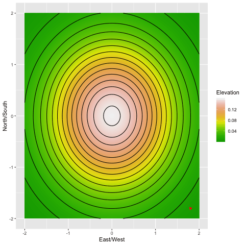

In progress, this will be a post which aims to explain in layman's terms the way that the addition of noise can help gradient descent escape spurious optima (and how this has an intuitive interpretation in our own lives)

```{r, include = FALSE, message = FALSE}
library(tidyverse)
library(gganimate)
library(transformr)
library(gifski)

```

# Outline

* Note, this was openly inspired by the writings of Tim Harford. I ound his descriptiption of the London Tube Strike and its implications while struggling through the study of Langevin diffusions, and I had been meaning to try and show some visualizations of noisy optimization for a while. He's a wonderful popular economics communicator, and a lot of fun to read.

* In general, try and think of any and all images you can include! minimize text. 

# The Perfect Scrambled Eggs 
(or "our optimized lives")

* [rw]My morning routine is perfectly optimized, a blend of art and science. I’ve settled on an order in which to take the ingredients for scrambled eggs, the exact selection of dishes to use to minimize washing, and the fact that my silver bowl has sides just low enough that beaten egg could escape, and that raw eggs go in the red bowl. I didn’t set out to figure this out, I just made scrambled eggs every morning for years, and over time saw tiny choices that make it go a little smoother. 


# Disruption, and the London Subway Strike

On February 4th, 2014, the workers of the London Tube (their underground subway), went on strike, forcing a number of station closures throughout the city. For three days, a subset of commuters found their usual routes to work blocked, and were forced to find alternatives. After the strike, the stations reopened, and life went back to normal.

But three economists saw the opportunity for a natural experiment: only certain commuters were disrupted by the closure, and data tracking individual travel ID cards could be used to compare their movements to those who were unaffected. And surprisingly, life *didn't* quite go back to normal after the ending of the strike. The ID card data showed that some of the impacted group stuck with their newly discovered routes, and their commuting time decreased as a result. 

They even claim that the strike was a net increase in commute time.^[Albeit, this seems much harder to rigorously prove, than to simply cite the study as a neat thought experiment, like I'm doing here.]


# Mathematical Framework 

The purpose of this post is to show how this concept can be naturally articulated in a mathematical framework.^[A rare, and extremely tenuous connection between areas of my research, and reality.] We are describing the challenge of optimization. Here's a sample definition, from the [DeepAI website](https://deepai.org/machine-learning-glossary-and-terms/mathematical-optimization).

> Mathematical optimization is the process of maximizing or minimizing an objective function by finding the best available values across a set of inputs. 

* For London commuters, their "objective function" might be the duration of the commute,^[Or you could add in other factors, like cost and pleasantness.], and the "available values across a set of inputs" might be the route they take.
* If we want to find the highest peak in a mountain range (an example we'll discuss in detail in the next section), the input might be the choice of latitude and longitude, and the objective the elevation at that point.
*  When baking chocolate chip cookies, the possible inputs might be the amount of each ingredient, and the order in which they are combined, and the objective function might be the tastiness of the resulting cookie. This isn't quite a joke, Google once ran a [cookie optimization experiment](https://static.googleusercontent.com/media/research.google.com/en//pubs/archive/46507.pdf) along these lines.^[I've tasted the resulting cookies, not bad for a cafeteria batch.]

Optimization is vitally important in applied mathematics and statistics, but it can be quite hard. The vast increase in computational power has broadened our horizons for what optimization challenges are possible, but many useful problems remain out of our reach.

Generally, in optimization, we assume that we can check the value of the objective function at some chosen input. We can try a certain route on the subway and time the duration, we can bake a batch of cookies and eat them, and we will imagine that we have some computer which takes in latitude and longitude coordinates and spits out the altitude (this is called a "query" to the objective function, or perhaps "oracle"). 

Our naive optimization strategy might be to just try a bunch of points. Maybe we can define a grid of latitude and longitude coordinates, check the elevation of each one, and pick the highest. But this naive approach only works when the potential choices of input are sufficiently narrow. In particular, we look at the "dimension" of the input space. Latitude and longitude represent a mere 2-dimensions. The number of points within an exhaustive "grid" of inputs grows exponentially with the dimension of the input. Cookies are comprised by some dozen ingredients. The famous Jacques Torres [cookie recipe](https://cooking.nytimes.com/recipes/1015819-chocolate-chip-cookies) has $12$ ingredients. If we wanted to try all combinations of a mere five levels of each ingredient, that would be over two hundred thousand possibilities, which is a bit much for even the hungriest baker. 

We are constantly confronting optimization challenges in our own life, and we rarely take this naive approach. Instead, we tend to look for small *local* optimizations, whose benefits we can easily identify. 

<!-- * Finding the best route on the subway is something we optimize. While often algorithmic services can do the work for us, in other cases (or the past), we have to figure it out ourselves, and we somehow pick our starting point. -->

<!-- * For an example, let's imagine we want to find the highest point in a mountain range. We can check an individual point, and see how high it is. How do we find the highest point? The analogy would be something like, instead of latitude and longitude in a mountain range, in our morning routine it would be that "series of choices for how we get to work".  -->

<!-- * Now, imagine instead of querying a computer for the height, you yourself were actually in that mountain range. What would you do? Well, you'd look for the peak, but what if you were in a forest? You'd go up. Specifically, you would look at the area around you for *local* guidance. -->

# Local Optimizations

Imagine if we bite into a warm cookie, and the text the texture is just right, but there's not enough chocolate.(more flowery language here?) We wouldn't just throw up our hands and start from scratch... we'd add more chocolate! It's hard to look at a cookie recipe, and imagine what the result will taste like. But we *can* taste a recipe, and imagine what a small tweak would taste like.

The "locality" in optimization refers to "closeness" in the input space. In latitude and longitude, this would be literal distance, while the definitions are a bit less cookie in the space of cookie ingredients and subway commutes. Broadly, we are pretty good at understanding. If we increase the amount of chocolate, we now they'll taste a bit more chocolate-y than they do now. If we increase the amounts of chocolate, butter, baking soda, reduce the amount of flour, and tweak the balance between brown and cane sugar, are we confident we know what the result will taste like? 

In the London Tube experiment, the researchers place some of the blame on the "stylized nature" of the Tube map displayed to commuters. Its spatial distortions make it difficult to spot major inefficiencies in their route, without some external push. By comparison, we can usually estimate the impact of these "local" changes by ourselves. If we get off one stop earlier, maybe our walk to work increases by a minute but we avoid the wait at a crowded station. These slight changes are a bit like increasing just a single ingredient in a cookie.


Personally, this describes my relationship with my own food. fijad

* In my own life, I find this with food all the time. I have a set rotation of dishes I love, that fit my criteria (hassle-free ingredients, saves well for leftoers, etc). I'm happy to make small chaanes to what I eat. I recently realized how well a lone, unadorned sweet potato went with some of my staples. That's a one step addition, and I can evaluate its impact as I walk the aisles of the store. Sure enough, it quickly became a staple.
* However, I'm sure there are many full dishes out there that would be just as good as my current rotation. But to find a new dish is a risk. There's no way for me to see all the the links in the chain. Will the ingredients be easy to find? Will I find the cooking burdensome? What will the end result taste like? Are my cooking supplies well suited to the task?

<!-- * We provide some new rules of the game. We know not only the value at these points, we know the shape/slope/etc of the area around it. This is a reasonable relaxation, because we can estimate this shape by querying our computer for the values of the areas near our point (are we going up or down). The rule is that we can't look far away to see where the peak is (perhaps we're stuck in the Appalachian forests, and not the sheer granite of the Sierra Nevada).  -->

<!-- * This isn't arbitrary, it's a natural understanding of how we actually operate. We are inherently *local* optimizers. We can easily assess the impact of small changes, not not large ones. -->

<!-- * On a morning commute, we can estimate whether taking a turn a few blocks early to avoid a stoplight saves us time. It's much harder to figure out in advance whether taking the bus or train is easy. -->

<!-- * Now, I'd wager that generally, we're rather good at making small (later, we will call these "local", due to their geometric interpretation) adjustments. If I realize that by taking a right a few blocks early, I can avoid the long traffic light, I'll often do it.  -->
<!-- * However, there's a reason these are small changes. We can estimate their impact from where we are. If we considered an entirely new route to work, taking a whole different train line, we would have no way to know what that's like. -->

Before, we imagined a challenge where we tried to find a peak of a mountain range, using a computer which could tell us the elevation of any chosen input point. Let's imagine that it also tells us the slope of the incline at that point ("which direction is down"). This better reflects our intuition for local optimization, but it's also not a large change to the game, because we could always simply query the elevation in a small area around our point, and gauge the slope ourselves. Imagine that we are hiking with an altimeter, and we can look around us and see the shape of the nearby slope. However, we can't just look around and find a faraway peak, because we're stuck in the forests of the Appalachians rather than the sheer granite ofthe Sierra Nevada. Our intuition tells us the optimization algorithm which is natural: from wherever we are, "go up".

# Gradient Ascent

This intuitive is called "gradient ascent". Wherever you are, go up. This is quite literal in the case of our mountain range, This section will provide its mathematical definition, but these details aren't important, and you can skip the notation and go straight to the visualizations if you'd like. 

## Mathematical Definition

<!-- Some explanation of continuous vs discrete space would be nice? -->
Imagine we are at some point $x \in \mathbb{R}^d$ (meaning, $x$ is a point in $d$-dimensional space). 
(Maybe in English first?)

Here's a mathematical definition of a crude version of gradient descent.^[This is for an extremely crude version with fixed step size $\eta$. There is no reason  to use fixed step size in practice, but that adjustment isn't relevant to the demonstration.] I'll describe it in regular words after.

1. Let $f: \mathbb{R}^d \to \mathbb{R}$ be our objective function. Let $\eta > 0$ be our scaling constant. We begin at some initial point $x^{(0)} \in \mathbb{R}^d$. For $k = 0, \ldots,$, until convergence, repeat steps 2 through 4(?).
2. Compute the gradient $\nabla f(x^{(k)})$.
3. Set $x^{(k+1)} \leftarrow x^{(k)} + \eta $\nabla f(x^{(k)})$.
4. If $\nabla f(x^{(k)})$ is sufficiently small, halt the algorithm, and select $x^{(k+1)}$ as our optima. Otherwise, select repeat s


<!-- http://timharford.com/2016/10/big-decision-ahead-just-roll-the-dice/ -->

## Convex, and Non-convex Optimization

*Which optimization challenges are hard? Math draws a fairly simple distinction. ^[Like maximization and minimization, convex and concave will be used interchangeably. The multiplying a convex function by minus $1$ makes it concave. Concave functions are easy to maximize, but we can switch between the two interchangeably.]

* In short, in the convex realm, local information provides global guidance. The local slope is pointing us in a direction 

* Description of convex vs non-convex optimization, why they are two fundamentally different challenges. 

## Visualizing Gradient Ascent

<!-- Need to go through and do better labels/etc for all these visualizations!  -->s
(Show the unimodel 2d case )

```{r, mesage = FALSE}
library(rayshader,)
library(magick)

grid.count <- 200
tb.uni <- crossing(x = seq(-2, 2, length.out = grid.count),
                   y = seq(-2, 2, length.out = grid.count)) %>%
  mutate(z = apply(dnorm(cbind(x,y)), 1, prod))

g.uni <- tb.uni %>% 
  ggplot(aes(x = x, y = y)) +
  geom_tile(aes(fill = z)) +
  geom_contour(aes(z = z), bins = 15, color = "black") +
  # scale_x_continuous("x", expand = c(0, 0)) +
  # scale_y_continuous("y", expand = c(0, 0)) +
  scale_fill_gradientn("z", colours = terrain.colors(10)) +
  coord_fixed()
g.uni
```

```{r, include = FALSE}
plot_gg(g.uni, 
        multicore = TRUE, 
        raytrace = TRUE, 
        width = 7, 
        height = 4,
        #      scale = 300, 
        windowsize = c(1400, 866), 
        zoom = .3, 
        phi = 30, 
        theta = 30)
render_snapshot(clear = TRUE)
```

Showing gradient ascent
```{r, include = FALSE}
GradBivarNormal <- function(x){
  -c(prod(dnorm(x))*x[1], prod(dnorm(x))*x[2])
}

steps <- 50
x.asc.seq <- matrix(rep(NA, 2*steps), ncol=2)
x.asc.seq[1,] <- rep(1.8, 2)
grad.seq <- matrix(rep(NA, 2*steps), ncol=2)
eta <- 2


for (i in 1:(steps-1)) {
  grad.seq[i,] <- GradBivarNormal(x.asc.seq[i,])
  x.asc.seq[i+1,] <-  x.asc.seq[i,] + grad.seq[i,]*eta
}

tb.asc <- tibble(x = x.asc.seq[,1], 
                 y = x.asc.seq[,2],
                 grad.x = grad.seq[,1],
                 grad.y = grad.seq[,2],
                 iter = 1:steps) %>% 
  mutate(x.next = x + grad.x*eta,
         y.next = y + grad.y*eta)
```

```{r, include = FALSE}
# now add line segments and etc.
g.uni <- tb.uni %>% 
  ggplot(aes(x = x, y = y)) +
  geom_tile(aes(fill = z)) +
  geom_contour(aes(z = z), bins = 15, color = "black") +
#  geom_segment(aes(x = 0, y = 0, xend = 1, yend=1)) +
  # scale_x_continuous("x", expand = c(0, 0)) +
  # scale_y_continuous("y", expand = c(0, 0)) +
  scale_fill_gradientn("z", colours = terrain.colors(10)) +
  coord_fixed()
g.uni

```

```{r, include = FALSE}
# p.uni.ascent <- g.uni + 
#   geom_point(data = tb.asc,
#              col = "red", 
#              size = 1) +
#   geom_segment(data = tb.asc,
#                aes(x = x, y = y, 
#                    xend = x.next, yend = y.next),
#                col = "red", size = .25,
#                arrow = arrow(length = unit(.2, "cm"), type = "closed"))
# 
# anim.uni.ascent <- p.uni.ascent + transition_states(iter,
#                                             transition_length = 1,
#                                             state_length = 1)
# animate(anim.uni.ascent,
#         nframes = 10 + max(tb.asc$iter),
#         renderer = gifski_renderer("2d_uni_grad_ascent_anim.gif"))
```




## The Perils of Non-convexity

```{r, include = FALSE}
w.2d <- c(1/3, 1/3, 1/3)
means.2d <- rbind(matrix(c(0, 4), nrow = 1),
                  matrix(c(sqrt(25/2), -sqrt(25/2)), nrow = 1),
                  matrix(c(-sqrt(25/2), -sqrt(25/2)+1), nrow = 1))
# We assume spherical variances
sd.2d <- c(1.7, 1.5, 2)

NormalMixtureDensity <- function(x) {
  component.probs <- sapply(1:3, function(i) dnorm(x, 
                                                   means.2d[i,], 
                                                   sd.2d[i]))
  apply(component.probs, 2, prod) %*% w.2d
}
NormalMixtureDensity_Vec <- function(x, y) {
  map2_dbl(x, y, function(.x, .y) {NormalMixtureDensity(c(.x,.y))})
}

grid.count <- 200
tb.grid <- crossing(x = seq(-10, 10, length.out = grid.count),
                    y = seq(-10, 10, length.out = grid.count)) %>%
  mutate(z = NormalMixtureDensity_Vec(x, y))
```


What about the multimodal case?
```{r}
# Basic plot of the setup
g.mix <- tb.grid %>% 
  ggplot(aes(x = x, y = y)) +
  geom_tile(aes(fill = z)) +
  geom_contour(aes(z = z), bins = 15, color = "black") +
  ylim(-7.5,7.5) + xlim(-7.5, 7.5)+
  scale_fill_gradientn("z", colours = terrain.colors(10)) +
  coord_fixed()
g.mix
```

Hopefully, some sort of 3d visualizatino to help explain the contours.
```{r, include = FALSE}
# plot_gg(g, 
#         multicore = TRUE, 
#         raytrace = FALSE, 
#         width = 7, 
#         height = 4,
#         #      scale = 300, 
#         windowsize = c(1400, 866), 
#         zoom = .3, 
#         phi = 30, 
#         theta = 30)
# render_snapshot(clear = TRUE)
```

* 3d view, to help get a sense of it.
```{r, include = FALSE}
#par(mfrow = c(1, 2))
# plot_gg(g, width = 7, height = 4, raytrace = FALSE, preview = TRUE)
# plot_gg(g, multicore = TRUE, raytrace = TRUE, width = 7, height = 4, 
#         scale = 300, windowsize = c(1400, 866), 
#         zoom = 0.6, phi = 30, theta = 30)

# plot_gg(g, 
#         raytrace = FALSE, 
#         preview = TRUE)
# plot_gg(g, 
#         multicore = TRUE, 
#         raytrace = TRUE,
#         zoom = 0.6, 
#         phi = 30, 
#         theta = 30)
# render_camera(zoom=0.5,theta=-30,phi=30)
# render_snapshot(clear = TRUE)
# Sys.sleep(0.2)
# render_snapshot(clear = TRUE)
```

* Animation, currently on 2d, to show how gradient ascent works

```{r, include = FALSE}

# The gradient of the normal w.r.t. x is (x-mu)/sigma^2*density.
GradMixtureNormal <- function(x) {
  # The densities for each of the three components
  component.probs <- apply(sapply(1:3, function(i) dnorm(x, 
                                                   means.2d[i,], 
                                                   sd.2d[i])), 2, prod)
  # Then, each of the three components have their x and y derivative.
  
  # We compute the  six (x-mu_i)/sigma_i^2 parts.
  mu.minus.x <- apply(means.2d, 1, function(r) r-x)
  mu.minus.x.div.sig <- t(apply(mu.minus.x, 1, function(r) r/sd.2d^2))
  
  # We multiply each by their corresponding component density
  temp <- t(apply(mu.minus.x.div.sig, 1, function(r) r*component.probs))
  return(c(temp %*% w.2d))
}

steps <- 200
x.asc.seq <- matrix(rep(NA, 2*steps), ncol=2)
x.asc.seq[1,] <- c(1.3, 0)
grad.seq <- matrix(rep(NA, 2*steps), ncol=2)
eta <- 40


for (i in 1:(steps-1)) {
  grad.seq[i,] <- GradMixtureNormal(x.asc.seq[i,])
  x.asc.seq[i+1,] <-  x.asc.seq[i,] + grad.seq[i,]*eta
}

tb.mix.asc <- tibble(x = x.asc.seq[,1], 
                 y = x.asc.seq[,2],
                 grad.x = grad.seq[,1],
                 grad.y = grad.seq[,2],
                 iter = 1:steps) %>% 
  mutate(x.next = x + grad.x*eta,
         y.next = y + grad.y*eta)
```


```{r, include = FALSE}
# p.mix.ascent <- g.mix +
#   geom_point(data = tb.mix.asc,
#              col = "red",
#              size = 1) +
#   geom_segment(data = tb.mix.asc,
#                aes(x = x, y = y,
#                    xend = x.next, yend = y.next),
#                col = "red", size = .25,
#                arrow = arrow(length = unit(.2, "cm"), type = "closed"))
# 
# anim.mix.ascent <- p.mix.ascent + transition_states(iter,
#                                             transition_length = 1,
#                                             state_length = 1)
# animate(anim.mix.ascent,
#         nframes = 10 + max(tb.mix.asc$iter),
#         renderer = gifski_renderer("2d_mix_grad_ascent_anim.gif"))

```


# Embracing Random Noise

# SGD, and Neural Nets

* We have seen randomization introduced quite literally, by a random movement. But randomization is often introduced less explicitly into popular algorithms. 
* Neural networks are the much heralded staple of the rise of machine learning. Their optimization, perhaps consistent of millions or billions of dimensions (we considered a *single* dimension for visualization purposes above)
* Microsoft boasted of a neural network with [17 billion(!)](https://www.microsoft.com/en-us/research/blog/zero-deepspeed-new-system-optimizations-enable-training-models-with-over-100-billion-parameters/) parameters, each of which are a dimension to be optimized. 
* The result is an enormous amount of potential spurious optima. 
* What we've found over the past decade, SGD works "unreasonably well". It's explicitly an algorithm for convex optimization, and yet it optimizes these deep networks.
* There are a variety of complex answers, depending on who you ask, but the staple reason which dates back [decades](https://leon.bottou.org/publications/pdf/nimes-1991.pdf) is that its inherent noisiness allows it to escape spurious local optima.^[And "saddle points", which I am skirting past here, as they are a similar concern for this high level explanation.] The noisiness comes not fro our explicit introduction, but from the its approximation error.
* The noise of SGD has little analogy in our own lives, but the way that noise becomes a tool, not a hindrance, in non-convex optimization, is very real.


SGD is the staple way to optimize neural networks. 

# Simulated Annealing/the other random optimization approaches?


# Wrapping Up

Of course, this is *hard*. 

A pointed self help message would say to fine and embrace randomness. But with no such agenda, I can say that’s true, but also incredibly hard to get right 

just look at the gif! this is all powerful theory, but hard to chose the right way to introduce noise. in a clean, mathematical scenario, we can study the sorts of noise that are optimal, without any cost. when it comes to our own personal life, we experience this noise as disruption. 

The famous computer scientist Alan Perlis said "Optimization hinders evolution", and it's true. This is the fundamental "explore vs exploit" trade-off. We could spend our energy searching for better strategies ("explore"), or we could focus on deriving the benefit from the currently known optimal strategy ("exploit"). In almost every application, there is a trade-off, and it's very hard to get right. I think our status quo bias and inherently "local" perspective means we'll typically err on the side of spending too little time exploring, but of course it's hard to know how to do that. 

But the takeaway could be something as simple as welcoming disruption, rather than resisting it. There's no point in getting mad at a change to your commute, the world won't notice (cite quote?), but maybe you can use the simple platitude that this is the necessary phase of exploration. 

Scrambled eggs are a wonderful way to start my morning. I doubt there's much more room to optimize the way I enjoy them. But I'd be foolish to think that there weren't wildly different options that were just as rewarding. [rw] 

```{r, include = FALSE}
location.params <- c(-10, 0, 10)
scale.params <- c(3.5, 3, 4)
weights <- c(.2, .4, .4)

CauchyMixtureDensity <- function(x,
                                 location.params,
                                 shape.params,
                                 weights) {
  densities <- map2(location.params, 
                    scale.params, 
                    function(.loc, .scale) dcauchy(x,
                                                   location = .loc, 
                                                   scale = .scale)) 
  return(do.call(cbind, densities) %*% weights)
}


DerivCauchy <- function(x, location, scale) {
  2*(location-x)/(scale^3*pi*(1+(-location+x)^2/scale^2)^2)
}

CauchyMixtureDerivative <- function(x,
                                    location.params,
                                    shape.params,
                                    weights) {
  densities <- map2(location.params, 
                    scale.params, 
                    function(.loc, .scale) DerivCauchy(x,
                                                       location = .loc, 
                                                       scale = .scale)) 
  return(do.call(cbind, densities) %*% weights)
}

# Scalar for gradient ascent
x.init <- 18
GradientAscentStep <- function(x, 
                               eta, 
                               location.params, 
                               scale.params, 
                               weights,
                               type = "Gradient Ascent") {
  deriv <- CauchyMixtureDerivative(x, 
                                   location.params, 
                                   scale.params, 
                                   weights) %>% 
    as.numeric()
  xprime <- x + eta*deriv + ifelse(type == "Noisy Ascent", 
                                   rnorm(1, 0, .5), 
                                   0)
  return(xprime)
}


RunGradientAscent <- function(x.init, 
                              location.params,
                              scale.params,
                              weights,
                              eta,
                              type = "Gradient") {
  max.iter <- 10000
  ascent.seq <- c(x.init)
  converged <- FALSE
  i <- 1
  while (! converged && i < max.iter) {
    ascent.seq[i+1] <- GradientAscentStep(ascent.seq[i],
                                          eta,
                                          location.params,
                                          scale.params,
                                          weights,
                                          type)
    i <- i + 1
    if (abs(ascent.seq[i] - ascent.seq[i-1])*100 < 10^(-4)) {
      converged <- TRUE
    }
  }
  return(ascent.seq)
}
tb.dens.grid <- tibble(x = seq(-20, 20, .1)) %>%
  mutate(y = as.numeric(CauchyMixtureDensity(x, 
                                             location.params, 
                                             scale.params, 
                                             weights)))
eta.grad.ascent <- 100
grad.ascent.seq <- RunGradientAscent(x.init, 
                                     location.params,
                                     scale.params,
                                     weights,
                                     eta = eta.grad.ascent, 
                                     type = "Gradient Ascent")

```


```{r, include = FALSE}
# tb.grad.ascent <- tibble(x = grad.ascent.seq,
#                          iter = seq_along(grad.ascent.seq)) %>%
#   arrange(iter) %>%
#   mutate(y = as.numeric(CauchyMixtureDensity(x, 
#                                              location.params, 
#                                              scale.params, 
#                                              weights)),
#          grad = as.numeric(CauchyMixtureDerivative(x, 
#                                                    location.params, 
#                                                    scale.params, 
#                                                    weights)),
#          x.next = x + eta.grad.ascent*grad,
#          y.next = as.numeric(CauchyMixtureDensity(x.next, 
#                                                   location.params, 
#                                                   scale.params, 
#                                                   weights)))
# p.ascent <- ggplot(tb.dens.grid, aes(x = x, y = y)) + 
#   geom_line() +
#   geom_point(data = tb.grad.ascent, 
#              col = "red", size = 1) +
#   geom_segment(data = tb.grad.ascent,
#                aes(x = x, y = y, xend = x.next, yend = y.next),
#                col = "red", size = .25,
#                arrow = arrow(length = unit(.2, "cm"), type = "closed"))  
# p.ascent
# 
# anim.ascent <- p.ascent + transition_states(iter,
#                                             transition_length = 1,
#                                             state_length = 1)
# animate(anim.ascent, 
#         nframes = 10 + max(tb.grad.ascent$iter),
#         renderer = gifski_renderer("test_grad_ascent_anim.gif"))
```


```{r, include = FALSE}
# eta.noisy.ascent <- 25
# noisy.ascent.seq <- RunGradientAscent(x.init, 
#                                       location.params,
#                                       scale.params,
#                                       weights,
#                                       eta = eta.noisy.ascent, 
#                                       type = "Noisy Ascent")
# 
# tb.noisy.ascent <- tibble(x = noisy.ascent.seq,
#                           iter = seq_along(noisy.ascent.seq)) %>%
#   arrange(iter) %>%
#   mutate(y = as.numeric(CauchyMixtureDensity(x, 
#                                              location.params, 
#                                              scale.params, 
#                                              weights)),
#          grad = CauchyMixtureDerivative(x, 
#                                         location.params, 
#                                         scale.params, 
#                                         weights),
#          x.next = x + eta.grad.ascent*grad,
#          y.next = as.numeric(CauchyMixtureDensity(x.next, 
#                                                   location.params, 
#                                                   scale.params, 
#                                                   weights)))
# # For now, only plot until it finds the max
# true.max <- max(tb.noisy.ascent$y)
# first.time.max <- tb.noisy.ascent %>% 
#   filter(y > .99*true.max) %>%
#   arrange(iter) %>%
#   slice(1) %>%
#   pull(iter)
# tb.noisy.ascent <- tb.noisy.ascent %>%
#   slice(1:first.time.max)
# 
# 
# 
# 
# p.noisy <- ggplot(tb.dens.grid, aes(x = x, y = y)) + 
#   geom_line() +
#   geom_point(data = tb.noisy.ascent, 
#              col = "red", size = 1) +
#   geom_segment(data = tb.noisy.ascent,
#                aes(x = x, y = y, xend = x.next, yend = y.next),
#                # aes(x = x, y = y, xend = x.next, yend = y.next),
#                col = "red", size = .25,
#                arrow = arrow(length = unit(.2, "cm"), type = "closed")) 
# p.noisy
# 
# anim.noisy <- p.noisy + transition_states(iter,
#                                           transition_length = 1,
#                                           state_length = 1)
# animate(anim.noisy, 
#         nframes = 10 + max(tb.noisy.ascent$iter),
#         renderer = gifski_renderer("test_noisy_ascent_anim.gif"))

```


<!-- ```{r, include = FALSE} -->
<!-- # f <- function(x) { -->
<!-- #   (-x^2 + 3*x -2)*(x^2 -.5*x + 6) -->
<!-- # } -->
<!-- # x.seq <- seq(-10, 10, .1) -->
<!-- # plot(x.seq, f(x.seq)) -->
<!-- ``` -->


# Sources
* ["Messy"](http://timharford.com/books/messy/), by Tim Harford.
* ["The Benefits of Forced Experimentation: Striking
Evidence from the London Underground Network" ](http://users.ox.ac.uk/~econ0360/FerdinandRauch/Tube.pdf), by Larcom, Rauch, & Willems (2017).
* Short [write-up](http://cep.lse.ac.uk/pubs/download/cp455.pdf) of the London Tube Strike research. 
* ["Bayesian Optimization for a Better Dessert"](https://static.googleusercontent.com/media/research.google.com/en//pubs/archive/46507.pdf), by Kochanski et al. (2017). 