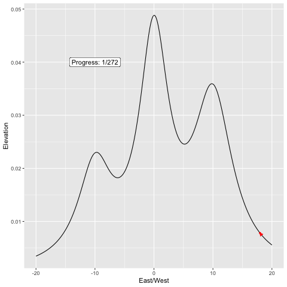

In progress, this will be a post which aims to explain in layman's terms the way that the addition of noise can help gradient descent escape spurious optima (and how this has an intuitive interpretation in our own lives). 

...

...

...
```{r}
library(tidyverse)
library(gganimate)
library(transformr)
library(gifski)
### Maybe it's best to first start one-dimensional, before biting off more 
# than I can chew...


location.params <- c(-10, 0, 10)
scale.params <- c(3.5, 3, 4)
weights <- c(.2, .4, .4)

CauchyMixtureDensity <- function(x,
                                 location.params,
                                 shape.params,
                                 weights) {
  densities <- map2(location.params, 
                    scale.params, 
                    function(.loc, .scale) dcauchy(x,
                                                   location = .loc, 
                                                   scale = .scale)) 
  return(do.call(cbind, densities) %*% weights)
}


DerivCauchy <- function(x, location, scale) {
  2*(location-x)/(scale^3*pi*(1+(-location+x)^2/scale^2)^2)
}

CauchyMixtureDerivative <- function(x,
                                    location.params,
                                    shape.params,
                                    weights) {
  densities <- map2(location.params, 
                    scale.params, 
                    function(.loc, .scale) DerivCauchy(x,
                                                       location = .loc, 
                                                       scale = .scale)) 
  return(do.call(cbind, densities) %*% weights)
}

# Scalar for gradient ascent
x.init <- 18

GradientAscentStep <- function(x, 
                               eta, 
                               location.params, 
                               scale.params, 
                               weights,
                               type = "Gradient Ascent") {
  deriv <- CauchyMixtureDerivative(x, 
                                   location.params, 
                                   scale.params, 
                                   weights) %>% 
    as.numeric()
  xprime <- x + eta*deriv + ifelse(type == "Noisy Ascent", 
                                   rnorm(1, 0, .5), 
                                   0)
  return(xprime)
}


RunGradientAscent <- function(x.init, 
                              location.params,
                              scale.params,
                              weights,
                              eta,
                              type = "Gradient") {
  max.iter <- 10000
  ascent.seq <- c(x.init)
  converged <- FALSE
  i <- 1
  while (! converged && i < max.iter) {
    ascent.seq[i+1] <- GradientAscentStep(ascent.seq[i],
                                          eta,
                                          location.params,
                                          scale.params,
                                          weights,
                                          type)
    i <- i + 1
    if (abs(ascent.seq[i] - ascent.seq[i-1])*100 < 10^(-4)) {
      converged <- TRUE
    }
  }
  return(ascent.seq)
}


###########
tb.dens.grid <- tibble(x = seq(-20, 20, .1)) %>%
  mutate(y = as.numeric(CauchyMixtureDensity(x, 
                                             location.params, 
                                             scale.params, 
                                             weights)))
eta.grad.ascent <- 100
grad.ascent.seq <- RunGradientAscent(x.init, 
                                     location.params,
                                     scale.params,
                                     weights,
                                     eta = eta.grad.ascent, 
                                     type = "Gradient Ascent")

```


```{r}
tb.grad.ascent <- tibble(x = grad.ascent.seq,
                         iter = seq_along(grad.ascent.seq)) %>%
  arrange(iter) %>%
  # mutate(x.next = lead(x, n = 1, default = NA)) %>%
  mutate(y = as.numeric(CauchyMixtureDensity(x, 
                                             location.params, 
                                             scale.params, 
                                             weights)),
         # y.next = as.numeric(CauchyMixtureDensity(x.next, 
         #                                          location.params, 
         #                                          scale.params, 
         #                                          weights)),
         grad = as.numeric(CauchyMixtureDerivative(x, 
                                                   location.params, 
                                                   scale.params, 
                                                   weights)),
         x.next = x + eta.grad.ascent*grad,
         y.next = as.numeric(CauchyMixtureDensity(x.next, 
                                                  location.params, 
                                                  scale.params, 
                                                  weights)))
p.ascent <- ggplot(tb.dens.grid, aes(x = x, y = y)) + 
  geom_line() +
  geom_point(data = tb.grad.ascent, 
             col = "red", size = 1) +
  geom_segment(data = tb.grad.ascent,
               aes(x = x, y = y, xend = x.next, yend = y.next),
               col = "red", size = .25,
               arrow = arrow(length = unit(.2, "cm"), type = "closed"))  
p.ascent

anim.ascent <- p.ascent + transition_states(iter,
                                            transition_length = 1,
                                            state_length = 1)
animate(anim.ascent, 
        nframes = 10 + max(tb.grad.ascent$iter),
        renderer = gifski_renderer("test_grad_ascent_anim.gif"))
```


```{r}
eta.noisy.ascent <- 25
noisy.ascent.seq <- RunGradientAscent(x.init, 
                                      location.params,
                                      scale.params,
                                      weights,
                                      eta = eta.noisy.ascent, 
                                      type = "Noisy Ascent")


tb.noisy.ascent <- tibble(x = noisy.ascent.seq,
                          iter = seq_along(noisy.ascent.seq)) %>%
  arrange(iter) %>%
  # mutate(x.next = lead(x, n = 1, default = NA)) %>%
  mutate(y = as.numeric(CauchyMixtureDensity(x, 
                                             location.params, 
                                             scale.params, 
                                             weights)),
         # y.next = as.numeric(CauchyMixtureDensity(x.next, 
         #                                          location.params, 
         #                                          scale.params, 
         #                                          weights)),
         grad = CauchyMixtureDerivative(x, 
                                        location.params, 
                                        scale.params, 
                                        weights),
         x.next = x + eta.grad.ascent*grad,
         y.next = as.numeric(CauchyMixtureDensity(x.next, 
                                                  location.params, 
                                                  scale.params, 
                                                  weights)))
# For now, only plot until it finds the max
true.max <- max(tb.noisy.ascent$y)
first.time.max <- tb.noisy.ascent %>% 
  filter(y > .99*true.max) %>%
  arrange(iter) %>%
  slice(1) %>%
  pull(iter)
tb.noisy.ascent <- tb.noisy.ascent %>%
  slice(1:first.time.max)


p.noisy <- ggplot(tb.dens.grid, aes(x = x, y = y)) + 
  geom_line() +
  geom_point(data = tb.noisy.ascent, 
             col = "red", size = 1) +
  geom_segment(data = tb.noisy.ascent,
               aes(x = x, y = y, xend = x.next, yend = y.next),
               # aes(x = x, y = y, xend = x.next, yend = y.next),
               col = "red", size = .25,
               arrow = arrow(length = unit(.2, "cm"), type = "closed")) 
p.noisy

anim.noisy <- p.noisy + transition_states(iter,
                                          transition_length = 1,
                                          state_length = 1)
animate(anim.noisy, 
        nframes = 10 + max(tb.noisy.ascent$iter),
        renderer = gifski_renderer("test_noisy_ascent_anim.gif"))

```



